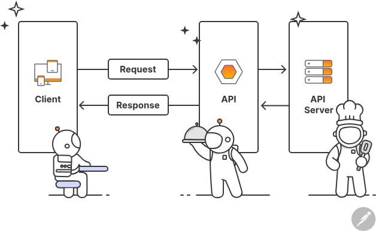
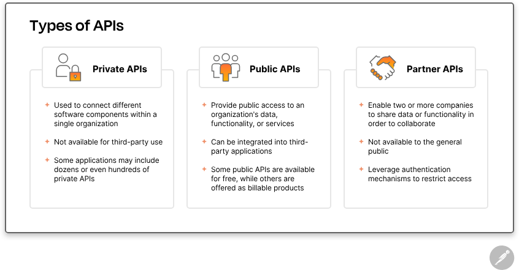

# 1 | Apa itu API

API, singkatan dari *application programming interface*, adalah sekumpulan protokol yang memungkinkan berbagai komponen perangkat lunak berkomunikasi dan saling bertukar data. Developer menggunakan API untuk menjembatani potongan-potongan kode kecil yang terpisah, sehingga bisa membangun aplikasi yang **lebih kuat, tangguh, aman, dan mampu memenuhi kebutuhan pengguna**.

Walaupun tidak terlihat, API ada di mana-mana—terus bekerja di belakang layar untuk menjalankan pengalaman digital yang jadi bagian penting dari hidup modern kita.

Di sini, kita akan memberikan gambaran tingkat tinggi tentang sejarah API dan cara kerjanya sebelum masuk ke berbagai jenis API dan bagaimana API digunakan. Kita juga akan membahas manfaat umum, kasus penggunaan API, dan beberapa contoh API di dunia nyata yang bisa membantu kamu mulai belajar.

---

## 1 | Apa sejarah API?

Untuk benar-benar memahami peran API dalam hidup kita, penting untuk melihat bagaimana API berkembang. API sudah ada sejak lama, dan API web modern mulai terbentuk pada awal tahun 2000-an. Sejak periode itu, sejarah API dapat dibagi secara kasar ke dalam lima fase berikut:

### 1.1 | Fase 1: API Komersial

Pada awal 2000-an, API web muncul sebagai cara baru bagi startup untuk tidak hanya menyediakan produk dan layanan secara online, tetapi juga memungkinkan mitra dan pihak ketiga memperluas jangkauan platform mereka. Era ini ditandai oleh perusahaan seperti **Salesforce, eBay, dan Amazon**, dan sampai sekarang perusahaan-perusahaan ini tetap mendominasi dunia API.

### 1.2 | Fase 2: API Media Sosial

Pada pertengahan 2000-an, lanskap API berubah ketika perusahaan baru—seperti **Flickr, Facebook, dan Twitter**—menyadari bahwa API dapat mengubah cara kita berbagi informasi satu sama lain. Meskipun API mereka tidak seerat API komersial dalam urusan pendapatan, API tersebut tetap memberikan nilai besar bagi organisasi mereka.

Contohnya, Facebook merilis versi 1.0 API-nya pada **Agustus 2006**, yang memungkinkan developer mengakses data seperti teman pengguna, foto, event, dan informasi profil. API ini berperan besar dalam mendorong Facebook menjadi salah satu jejaring sosial paling populer di dunia.

### 1.3 | Fase 3: API Cloud

Pada 2006, Amazon memperkenalkan **Amazon Simple Storage (S3)**, yang menandai titik penting berikutnya dalam sejarah API. S3 adalah layanan penyimpanan dasar di mana sumber daya dapat diakses melalui **API** dan **CLI**, dan model *pay-as-you-go*-nya menyediakan cara yang efisien biaya bagi organisasi untuk memonetisasi aset digital di ekonomi online.

Hanya enam bulan kemudian, Amazon merilis **Amazon Elastic Compute (EC2)**, yang memungkinkan developer menggunakan API web untuk men-deploy infrastruktur yang mendukung generasi aplikasi berikutnya. Baik S3 maupun EC2 masih memainkan peran penting dalam pengembangan aplikasi hingga saat ini.

### 1.4 | Fase 4: API untuk Aplikasi Mobile

Dunia diperkenalkan dengan **iPhone** dari Apple dan **Android** dari Google pada 2007. Kemampuan membawa web di saku kita mengubah cara hidup secara radikal—dan mendorong investasi besar dalam aplikasi mobile yang digerakkan oleh API.

Contohnya:

- **Twilio** meluncurkan platform *API-as-a-product* pada 2007, memungkinkan developer membuat dan menerima panggilan telepon dari aplikasi cloud mana pun.
- **Instagram** meluncurkan aplikasi berbagi foto untuk iPhone pada Oktober 2010, dan dalam tiga bulan sudah memiliki satu juta pengguna. Awalnya Instagram tidak menyediakan API, tapi mulai mengembangkannya pada awal 2011 sebagai respons terhadap permintaan pengguna.

Perusahaan-perusahaan yang berfokus pada API ini memainkan peran penting dalam membuat *blueprint* bagaimana API disediakan hingga hari ini.

### 1.5 | Fase 5: API untuk Perangkat Terhubung

Sekitar 2010, beberapa developer mulai menggunakan API untuk menghubungkan benda-benda sehari-hari—seperti kamera, termostat, speaker, mikrofon, dan sensor—ke cloud.

Generasi perangkat ini, termasuk **Fitbit, Nest, Alexa**, dapat mengirim dan menerima data, konten, media, dan sumber daya digital lainnya, semakin mengubah cara kita berinteraksi dengan dunia di sekitar kita.

---

## 2 | Bagaimana API bekerja?

API bekerja dengan cara **berbagi data antara aplikasi, sistem, dan perangkat**. Ini terjadi melalui siklus **request (permintaan) dan response (tanggapan)**. Request dikirim ke API, API mengambil data, lalu mengembalikannya ke pengguna. Berikut gambaran tingkat tinggi tentang proses tersebut.

### 2.1 | API Client

API client bertanggung jawab untuk memulai “percakapan” dengan mengirimkan request ke API server. Request bisa dipicu dengan berbagai cara.

Contohnya:

* Seorang pengguna memasukkan kata kunci pencarian atau mengklik tombol.
* Request juga bisa dipicu oleh **peristiwa eksternal**, seperti notifikasi dari aplikasi lain.

### 2.2 | API Request

Bentuk dan perilaku API request bisa berbeda-beda tergantung jenis API, tapi biasanya mencakup komponen-komponen berikut:

* **Endpoint:** Endpoint API adalah URL khusus yang memberikan akses ke sumber daya tertentu. Misalnya, endpoint `/articles` pada aplikasi blog berisi logika untuk memproses semua request yang terkait dengan artikel.

* **Method:** Method pada request menunjukkan jenis operasi yang ingin dilakukan client terhadap sumber daya tertentu. Pada **REST API**, method menggunakan HTTP standar untuk melakukan aksi umum seperti **mengambil, membuat, memperbarui, atau menghapus data**.

* **Parameters:** Parameter adalah variabel yang dikirim ke endpoint API untuk memberikan instruksi spesifik agar API dapat memproses request. Parameter ini bisa dimasukkan melalui URL, query string, atau request body. Contohnya, endpoint `/articles` bisa menerima parameter `topic` untuk mengakses dan mengembalikan artikel terkait topik tertentu.

* **Request headers:** Header request adalah pasangan key-value yang memberikan detail tambahan tentang request, seperti tipe konten atau kredensial autentikasi.

* **Request body:** Body adalah bagian utama dari request yang berisi data aktual yang dibutuhkan untuk membuat, memperbarui, atau menghapus sumber daya. Misalnya, saat membuat artikel baru pada aplikasi blog, body request biasanya berisi **konten artikel, judul, dan penulis**.

### 2.3 | API Server

API client mengirim request ke **API server**, yang bertanggung jawab untuk menangani **autentikasi**, memvalidasi data input, serta mengambil atau memanipulasi data.

### 2.4 | API Response

Akhirnya, API server mengirimkan **response** kembali ke client. API response biasanya mencakup komponen berikut:

* **Status code:** Kode status HTTP adalah kode tiga digit yang menunjukkan hasil dari API request. Contoh paling umum:

    * `200 OK` → server berhasil mengembalikan data yang diminta
    * `201 Created` → server berhasil membuat sumber daya baru
    * `404 Not Found` → server tidak menemukan sumber daya yang diminta

* **Response headers:** Mirip dengan request headers, tapi digunakan untuk memberikan informasi tambahan tentang response server.

* **Response body:** Body response berisi data atau konten yang diminta client—atau pesan error jika terjadi kesalahan.

### 2.5 | Analogi Restoran

Untuk memahami proses ini dengan lebih mudah, bayangkan API seperti restoran:

* **Customer** → pengguna yang memberitahu waiter apa yang dia inginkan
* **Waiter** → API client, menerima pesanan dan menerjemahkannya menjadi instruksi yang mudah diikuti oleh dapur, kadang dengan kode atau singkatan khusus
* **Kitchen staff** → API server, menyiapkan pesanan sesuai spesifikasi customer dan menyerahkannya kembali ke waiter
* **Waiter** → mengantarkan pesanan ke customer

Dengan cara ini, alur **request → server → response** jadi lebih mudah dibayangkan.

---

## 3 | Apa Saja Manfaat API?

API menghubungkan berbagai sistem perangkat lunak, aplikasi, dan perangkat dengan memungkinkan mereka saling berkomunikasi. Hal ini membuka banyak manfaat, mulai dari pengalaman pengguna yang lebih baik hingga peningkatan efisiensi bisnis. Manfaat API yang paling umum meliputi:

* **Otomatisasi:** API dapat digunakan untuk **mengotomatiskan pekerjaan yang repetitif dan memakan waktu**, sehingga manusia bisa fokus pada tugas yang lebih kompleks. Ini meningkatkan produktivitas, terutama bagi developer dan tester.

* **Inovasi:** **Public API** dapat digunakan oleh tim engineering eksternal, mendorong inovasi dan mempercepat pengembangan dengan memungkinkan developer memanfaatkan fungsionalitas yang sudah ada untuk membuat pengalaman digital baru.

* **Keamanan:** API dapat memberikan **lapisan perlindungan tambahan** terhadap akses tidak sah dengan mewajibkan autentikasi dan otorisasi untuk setiap request yang mengakses data sensitif.

* **Efisiensi biaya:** API menyediakan akses ke **alat pihak ketiga dan infrastruktur** yang berguna, sehingga bisnis bisa menghindari biaya besar untuk membangun sistem kompleks sendiri.

---

## 4 | Apa Saja Jenis API?

Ada banyak jenis API dan cara mengkategorikannya. Salah satunya adalah berdasarkan **siapa yang memiliki akses**. Kerangka organisasi ini mencakup:

* **Private APIs (API Pribadi):**
  API pribadi, juga dikenal sebagai **internal API**, digunakan untuk menghubungkan berbagai komponen perangkat lunak dalam satu organisasi dan **tidak tersedia untuk pihak ketiga**.
  Contohnya, aplikasi media sosial mungkin memiliki:

    * satu private API untuk menangani alur login,
    * private API lain untuk mengelola feed,
    * dan private API lain untuk memfasilitasi komunikasi antar pengguna.
      Beberapa aplikasi bahkan bisa memiliki puluhan atau ratusan private API.

* **Public APIs (API Publik):**
  API publik memberikan **akses publik** ke data, fungsionalitas, atau layanan organisasi, sehingga developer pihak ketiga dapat mengintegrasikannya ke aplikasi mereka sendiri.
  Beberapa API publik tersedia gratis, sementara yang lain ditawarkan sebagai produk berbayar.
  Contohnya, aplikasi e-commerce bisa menggunakan **public payment API** seperti Stripe untuk memproses pembayaran tanpa harus membangun fungsionalitas itu dari awal.

* **Partner APIs (API Mitra):**
  Partner API memungkinkan **dua atau lebih perusahaan berbagi data atau fungsionalitas** untuk berkolaborasi dalam suatu proyek.
  API ini **tidak tersedia untuk publik** dan menggunakan mekanisme autentikasi untuk memastikan hanya mitra yang berwenang yang bisa menggunakannya.

---

## 5 | Apa Saja Arsitektur API yang Paling Umum?

API juga dapat dikategorikan berdasarkan **gaya arsitektur**. Beberapa gaya arsitektur yang paling sering digunakan adalah:

1. REST — Seperti yang telah dibahas sebelumnya, REST adalah arsitektur API yang paling populer untuk mentransfer data melalui internet. Dalam konteks RESTful, sumber daya dapat diakses melalui **endpoint**, dan operasi dilakukan pada sumber daya tersebut menggunakan HTTP standar seperti **GET, POST, PUT, dan DELETE**.

2. SOAP — (*Simple Object Access Protocol*) menggunakan **XML** untuk mentransfer pesan yang sangat terstruktur antara client dan server. SOAP sering digunakan di lingkungan enterprise atau sistem legacy. Meskipun menawarkan fitur keamanan yang canggih, SOAP bisa lebih lambat dibanding arsitektur API lain.

3. GraphQL — adalah bahasa query open source yang memungkinkan client berinteraksi dengan **satu endpoint API** untuk mengambil data persis yang dibutuhkan, tanpa harus membuat banyak request berantai. Pendekatan ini mengurangi jumlah perjalanan bolak-balik antara client dan server, berguna untuk aplikasi yang berjalan di jaringan lambat atau tidak stabil.

4. Webhooks — digunakan untuk mengimplementasikan **arsitektur berbasis event**, di mana request dikirim otomatis sebagai respons terhadap pemicu berbasis event.
   Contoh: saat terjadi event tertentu di aplikasi—misalnya pembayaran dilakukan—aplikasi dapat mengirim **HTTP request** ke URL webhook yang sudah dikonfigurasi dengan data event di payload request. Sistem penerima webhook kemudian memproses event dan mengambil tindakan yang sesuai.

5. gRPC — (*Remote Procedure Call*) memungkinkan client memanggil server seolah-olah server adalah objek lokal. gRPC dikembangkan oleh Google dan memudahkan komunikasi antara aplikasi dan sistem yang terdistribusi.

---

## 6 |Apa Saja Kasus Penggunaan API yang Umum?

API sangat fleksibel dan mendukung berbagai kasus penggunaan, antara lain:

1. **Integrasi dengan sistem internal dan eksternal**   Salah satu alasan paling umum developer menggunakan API adalah untuk **mengintegrasikan satu sistem dengan sistem lain**.
   Contohnya, kamu bisa menggunakan API untuk menghubungkan **CRM** dengan **sistem otomatisasi pemasaran**, sehingga email pemasaran dapat dikirim secara otomatis ketika seorang sales menambahkan calon pelanggan baru ke CRM.

2. **Menambahkan atau meningkatkan fungsionalitas**
   API memungkinkan kamu menambahkan **fungsionalitas tambahan** ke aplikasi, yang bisa meningkatkan pengalaman pengguna.
   Contohnya, pada aplikasi **food delivery**, kamu bisa mengintegrasikan API peta pihak ketiga agar pengguna bisa **melacak pesanan** mereka secara real-time.

3. **Menghubungkan perangkat IoT**
   API sangat penting dalam ekosistem **Internet of Things (IoT)**, yang mencakup perangkat seperti jam pintar, tracker kebugaran, bel pintu, dan peralatan rumah tangga.
   Tanpa API, perangkat-perangkat ini tidak bisa terhubung ke cloud atau satu sama lain, sehingga fungsinya akan terbatas.

4. **Membuat sistem lebih skalabel**
   API digunakan untuk membangun **arsitektur berbasis microservices**, di mana aplikasi terdiri dari kumpulan layanan kecil yang berkomunikasi melalui API pribadi.
   Microservices dikelola, di-deploy, dan disiapkan secara independen, sehingga tim bisa **menskalakan sistem secara andal dan efisien biaya**.

5. **Mengurangi biaya**
   API membantu organisasi **mengurangi biaya operasional** dengan mengotomatiskan tugas yang memakan waktu, seperti mengirim email, mengambil laporan, dan berbagi data antar sistem.
   API juga bisa **mengurangi biaya pengembangan** dengan memungkinkan tim menggunakan fungsionalitas yang sudah ada, tanpa harus membangun dari awal.

6. **Meningkatkan keamanan dan tata kelola organisasi**
   API mendukung banyak workflow penting untuk **keamanan organisasi**.
   Contohnya, **single sign-on (SSO)**—yang memungkinkan pengguna memakai satu username dan password untuk beberapa sistem—dimungkinkan berkat API.
   API juga digunakan untuk **menegakkan dan mengotomatisasi aturan serta kebijakan perusahaan**, misalnya memastikan pengeluaran harus disetujui sebelum karyawan mendapat reimburse.

Daftar ini tentu **belum lengkap**, dan akan terus berkembang seiring developer menciptakan solusi inovatif yang mengubah cara kita **hidup, bekerja, dan berinteraksi**.
